# FMC Website Mockup

[view here](http://fmc.scottxbrown.com)

A sample website to give visitors the basic information on the company, as well as a member dashboard area (that would be token-gated by owning the FMC NFT).

Built with: `NextJS`, Alchemy API's, NFTGO API's, `Javascript`, and `CSS`.

***

# Project Status

**This project is polished enough to host on my portfolio, but certain components/features are currently in development.** All informational pages/sections are complete, first four dashboard components are complete as well as web3 wallet connection, but last 2 component ideas are still being developed. This project isn't used or going to be sold to anybody, so the priority isn't there except for learning experience for myself.

**Users can connect their NFT/crypto wallet (or key in a wallet address) and see visual gallery of NFTs held, cryptocurrency balances held, last 30 day transaction history, and check floor price/holding period/holding amount of BAYC NFT colletion (can be configured to any collection.)**

***

# Project Screen Shots

Landing page:
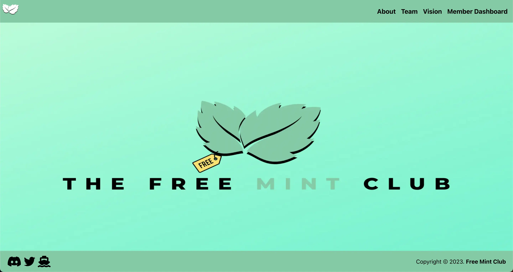

Landing page (MOBILE VIEW):
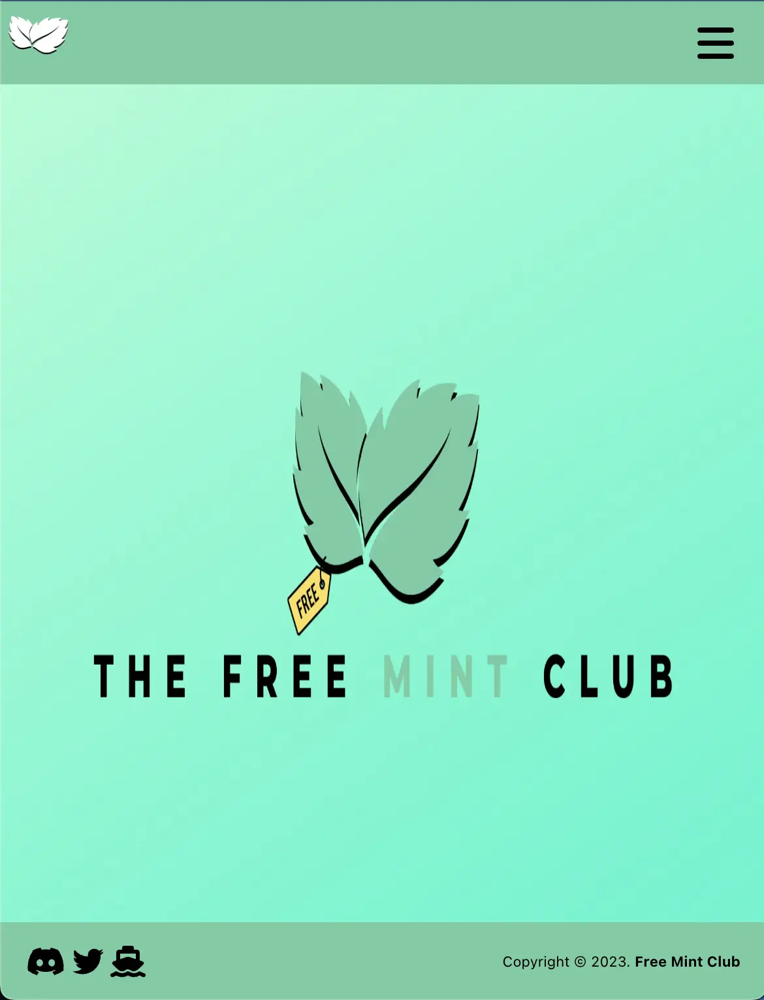

Landing page with menu open (MOBILE VIEW):
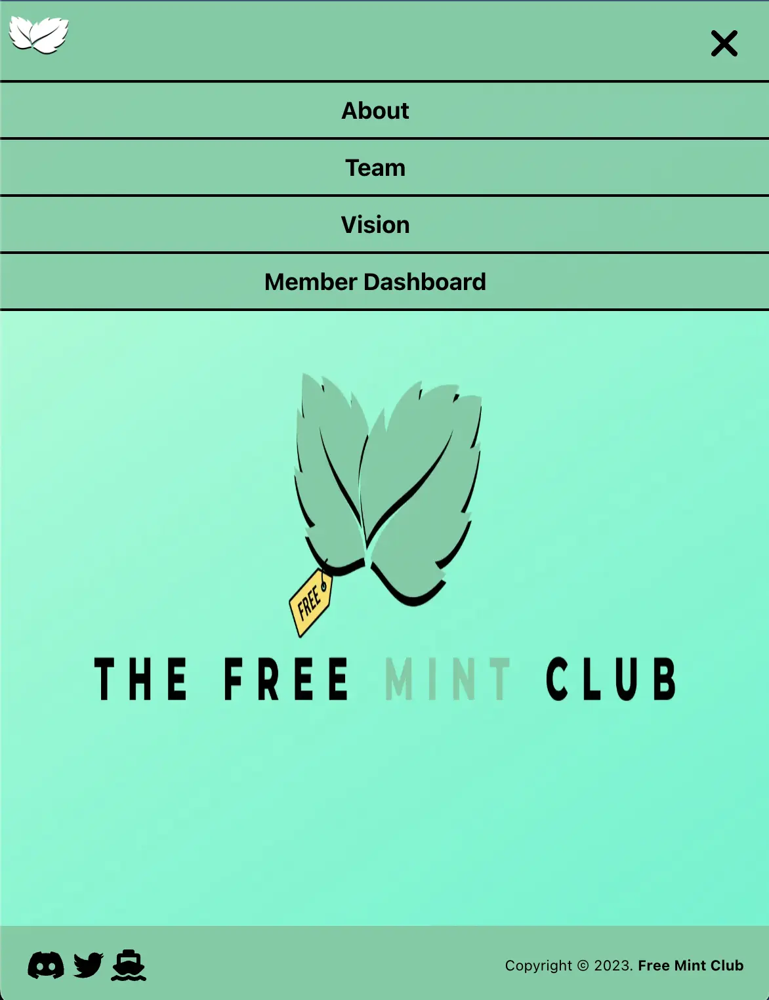

Team page (using CSS grid):
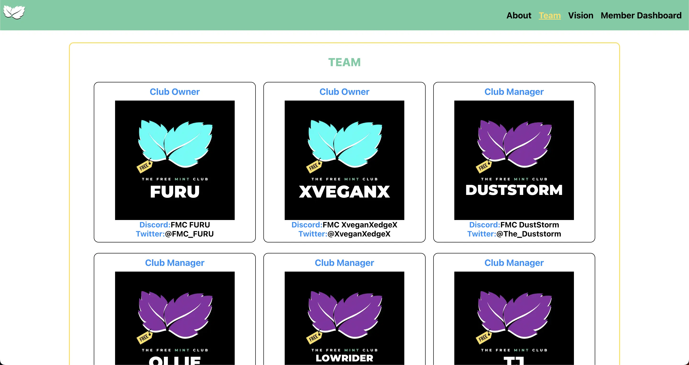

Team page (MOBILE VIEW):
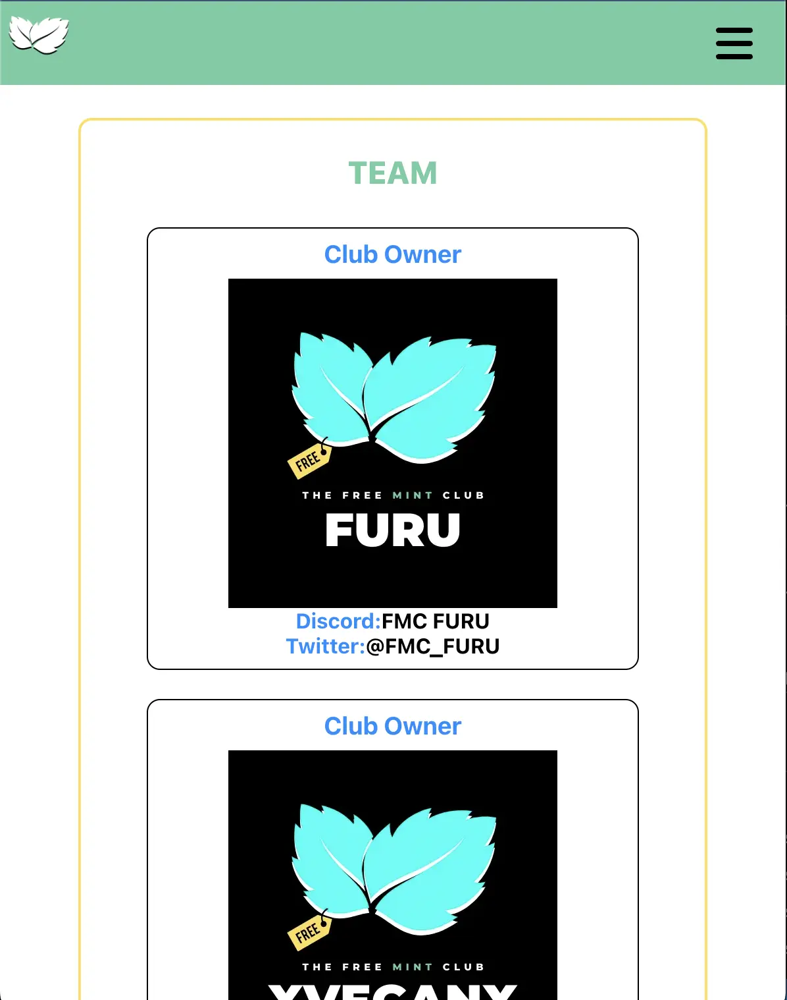

Team page with menu open (MOBILE VIEW):
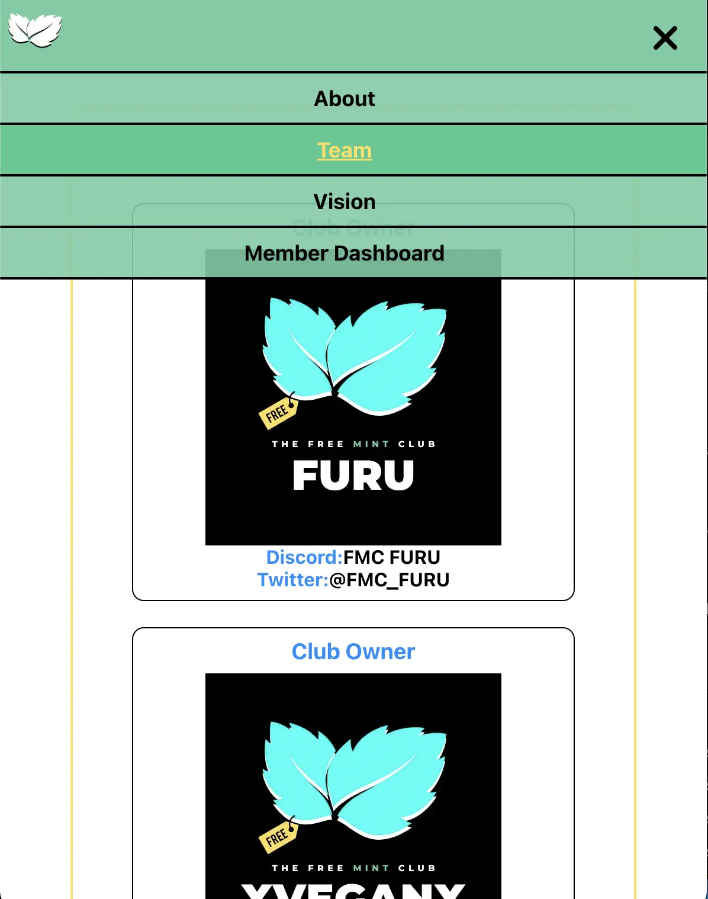

Member dashboard intro page:
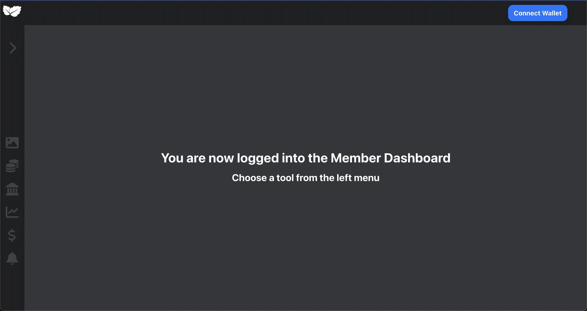

NFT Gallery page:
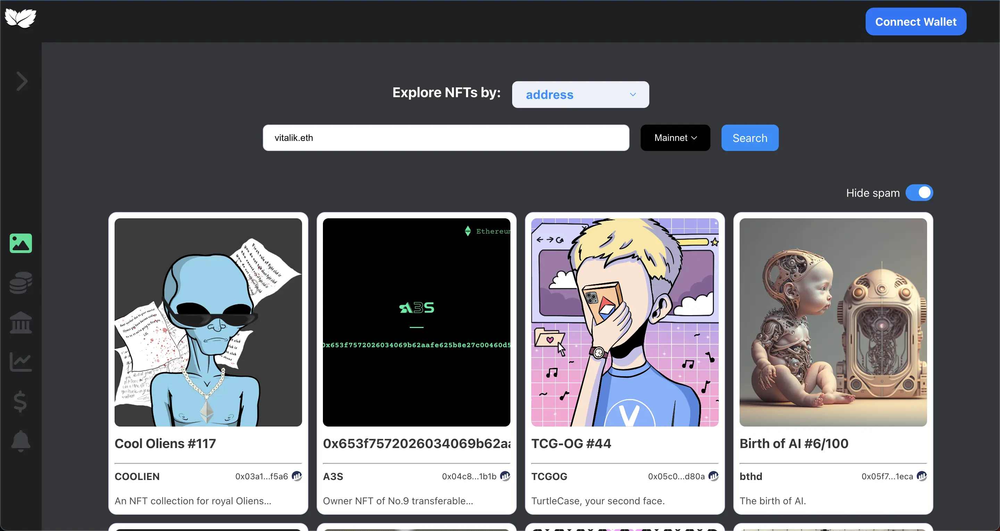

Wallet page with user's wallet connected:
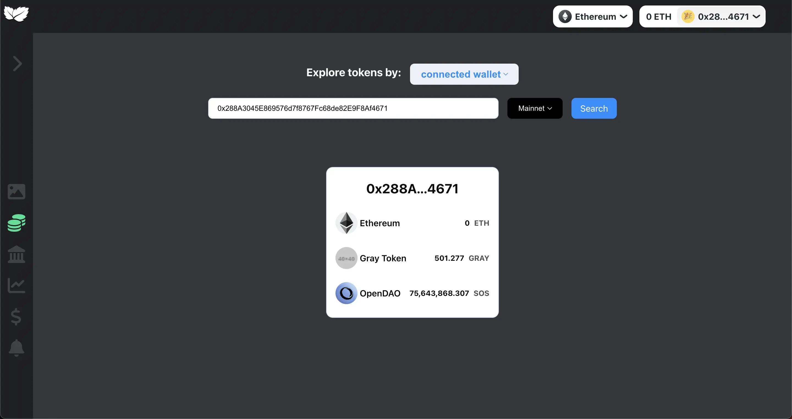

Transaction history page with user's wallet connected:
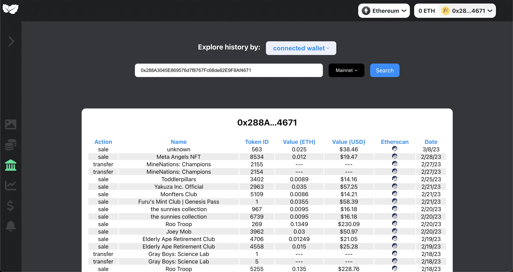

Transaction history page (MOBILE VIEW):
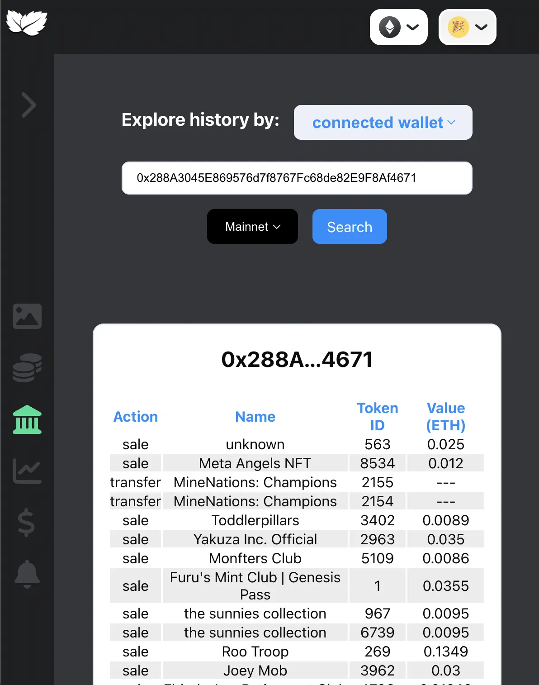

Charting page:
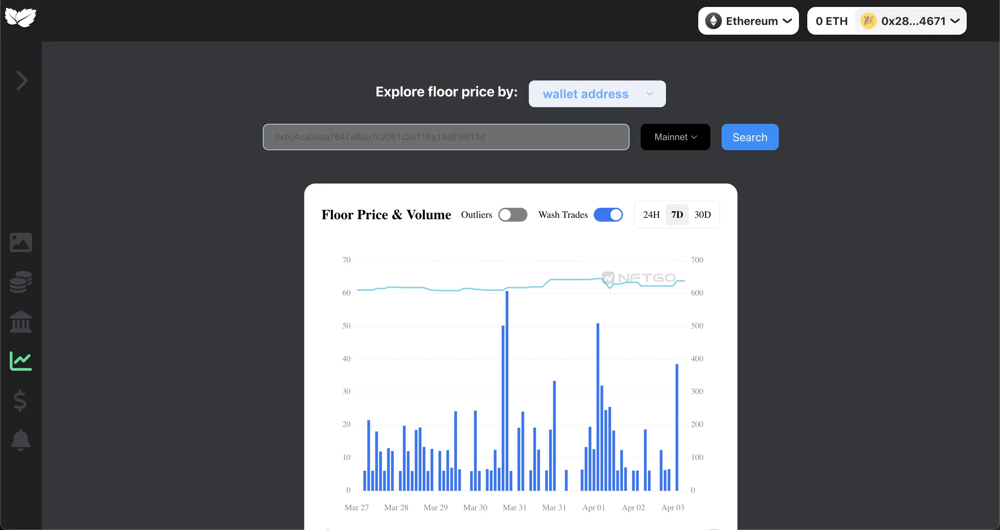
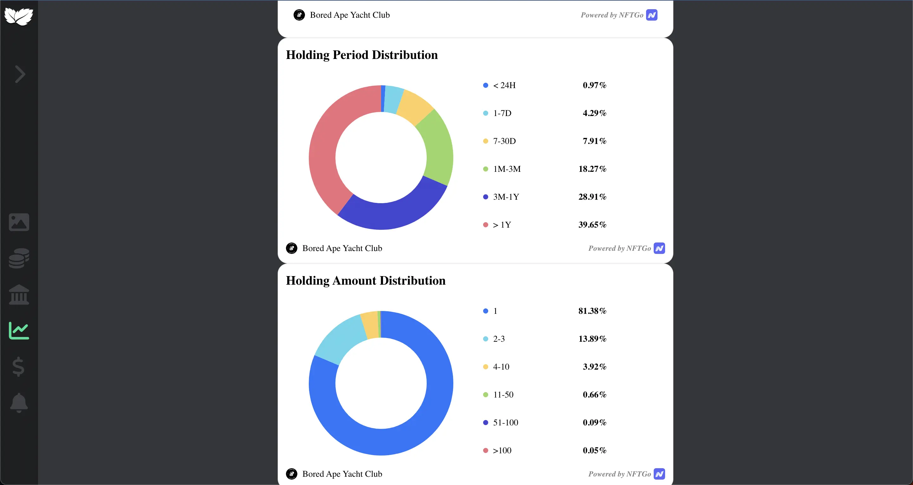

Marketplace page (mockup in progress):
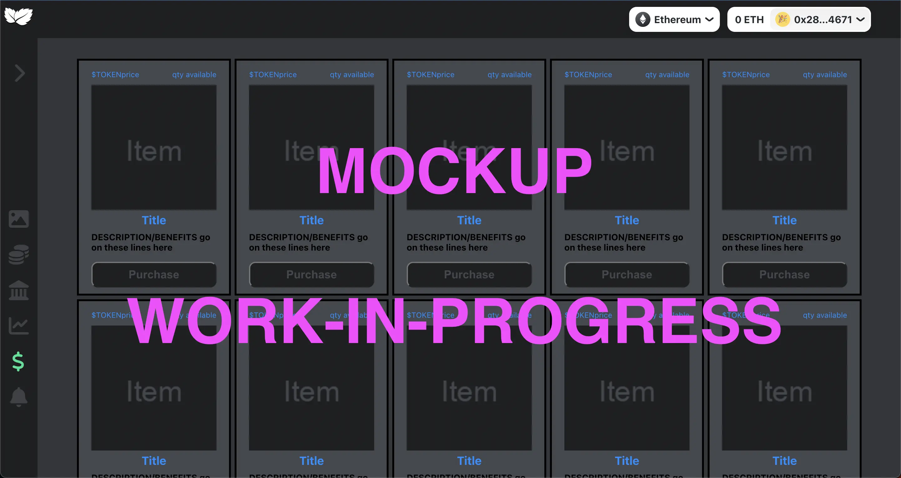

***

# Reflection

**This project is a mockup site for a company that I co-founded in late September 2021.** This company started as a discord server for NFT traders and friends. It quickly grew to over 15k members and 60k twitter followers all organically (no bots.) The server was focused on NFT education and alpha, and as such we also launched our own NFT to token-gate the valuable information in April 2022. 

**I gave myself 3 weeks to see how far I could get on a prototype for a wesbite.** Project goals included using technologies learned up until this point, getting more familiar with 3rd party APIs, and trying to build something that could be used in the web3 NFT world.

Originally, I wanted to build a component in the dashboard section of site that was an NFT marketplace (users could buy NFTs/items here.) I started this process by using the `create-react-app` boilerplate, then adding `react-router-6.3`, and `font-awesome` icons.

One of the main challenges I ran into was getting the necessary API keys for data I wanted. This led me to spending a few days researching what solutions and other APIs existed. Due to project time constraints, I had to table the NFT marketplace and focus more on what I had access to now.

I found the web3 company Alchemy, and their SDK. I was able to get an API key for them and another company and start building again. For what I had newly intended (user's wallet information - NFTs, crypto, transactions, etc), Alchemy required `NextJS` instead of React. I had never used NextJS before this, but was determined to learn and accomplish what I could. I quickly followed both Alchemy and Next documentation to get my project migrated over and have the NFT Gallery component working. **This product was new for Alchemy and I found many enhancements that it needed - so I also submitted issues and pull requests to their open source code while coding this project. Many have been implemented/merged, so now I am a contributor of the `create-web3-dapp nft explorer` template.**

I chose to use the `create-web3-dapp` boilerplate provided by Alchemy to minimize initial project setup/NFT gallery component, invest more time diving into other features, and polishing the look of this site mockup. I plan on continuing this development as I have time by adding a few more components, optimizing code even more, and gaining more experience with NextJS.

**At the end of the 3 week period, this mockup has all information needed about the company and a dashboard area that includes:**
- connection to the user's web 3 wallet or typed in wallet address
- gallery of nfts
- token balances
- last 30 day history of transactions
- floor price and holder informational charts by collection
- and some more work-in-progress components.

**The technologies implemented in this project are:**
- NextJS
- Alchemy SDK
- NFTGO API
- Font Awesome Icons
- and a significant amount of: 
    - VanillaJS
    - JSX
    - and CSS

**And I was able to contribute to this company's open source code to better their product offered:**
- You can view open/closed issues and PR's [here](https://github.com/alchemyplatform/cw3d-nft-explorer).